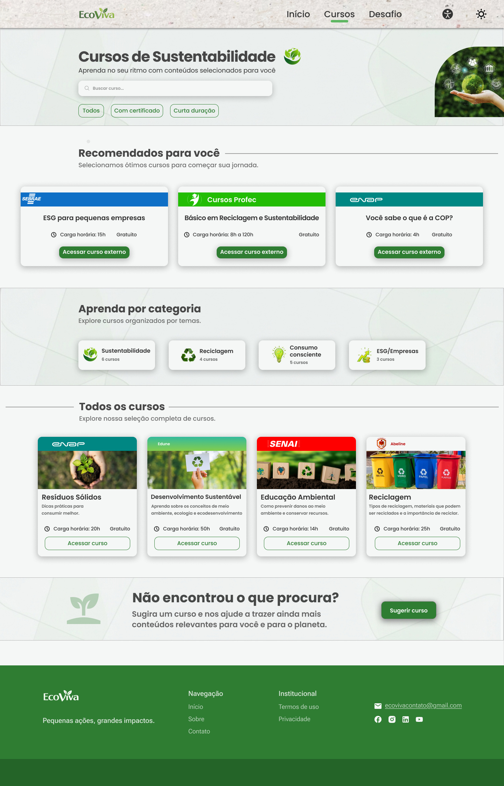
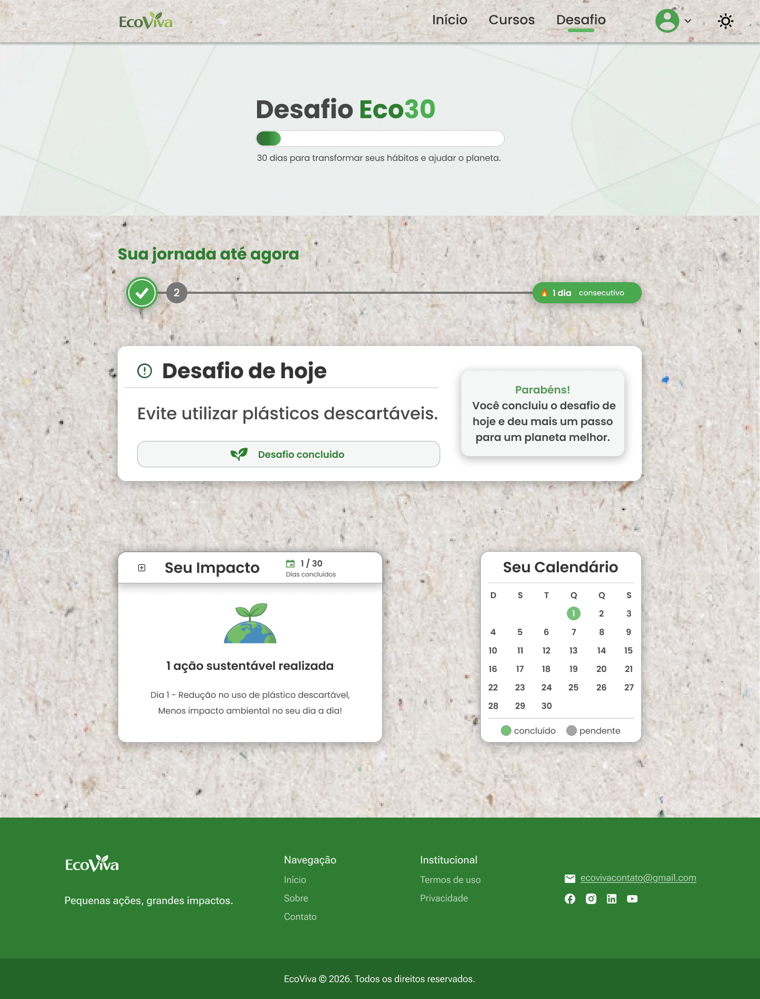
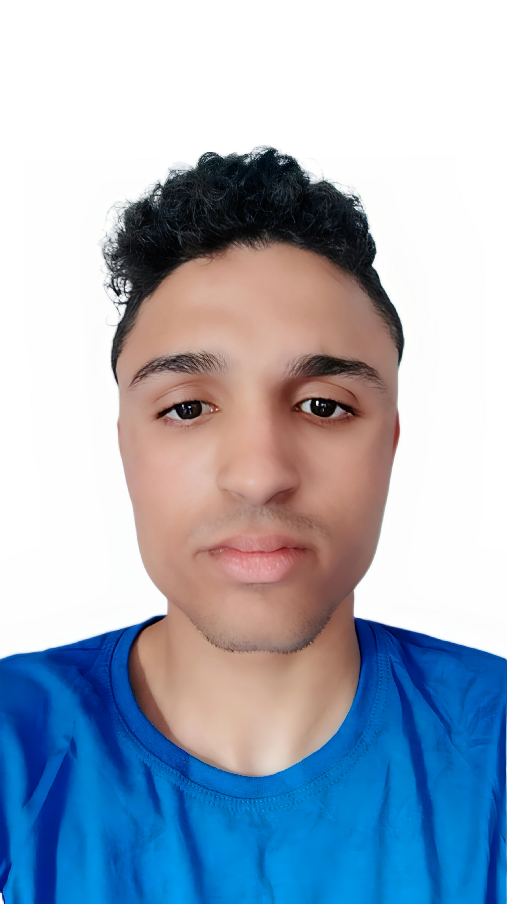

# 🌱 Ecoviva

  

  
  
  
  

Ecoviva é uma plataforma de ensino sustentável, criada com o objetivo de promover conhecimento sobre práticas ecológicas e incentivar um estilo de vida mais consciente.

## 🚀 Tecnologias utilizadas

O projeto foi desenvolvido utilizando tecnologias puras, sem o uso de frameworks:

- HTML5
- CSS3
- JavaScript

## 🌐 Deploy

A aplicação foi publicada utilizando a plataforma Vercel.

## 🎓 Sobre o projeto

  <!-- Substitua os links caso queira usar imagens locais -->
  
  &nbsp;&nbsp;&nbsp;&nbsp;
  

Este projeto foi desenvolvido durante o curso **Transforme-se**, uma iniciativa realizada pelo **Instituto Proa** em parceria com o **Serasa Experian**.

O curso proporcionou a base necessária para o desenvolvimento do Ecoviva, permitindo a aplicação prática de conhecimentos em desenvolvimento web e trabalho em equipe.

## 📸 Prints do projeto

### 🏠 Home

  

### 📚 Área de Cursos

  

### 🌱 Desafio Eco30

  

  ## 👥 Integrantes
## 👥 Integrantes

<table align="center">
  <tr>
    <td align="center">
      <a href="https://github.com/nesrux/">
         
        <b>João Marcos</b>
      </a>
    </td>
    <td align="center">
      <a href="LINK_GITHUB_INGRID">
         
        <b>Ingrid</b>
      </a>
    </td>
    <td align="center">
      <a href="LINK_GITHUB_KETHELEEN">
         
        <b>Ketheleen</b>
      </a>
    </td>
    <td align="center">
      <a href="LINK_GITHUB_NATHAN">
         
        <b>Nathan</b>
      </a>
    </td>
    <td align="center">
      <a href="LINK_GITHUB_GEOVANNA">
         
        <b>Geovanna</b>
      </a>
    </td>
  </tr>
</table>